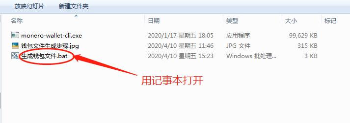
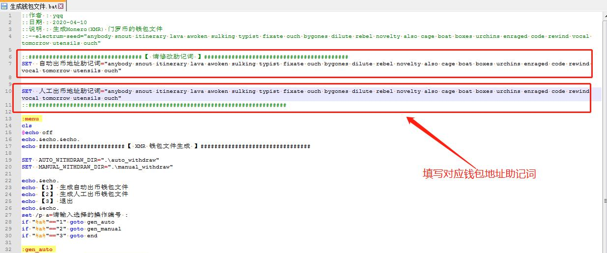
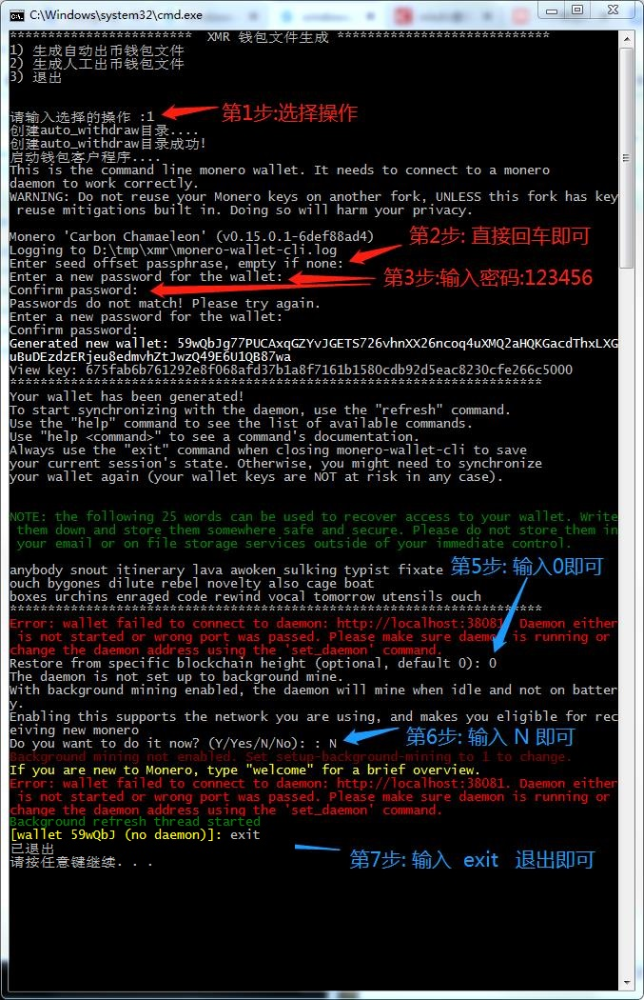
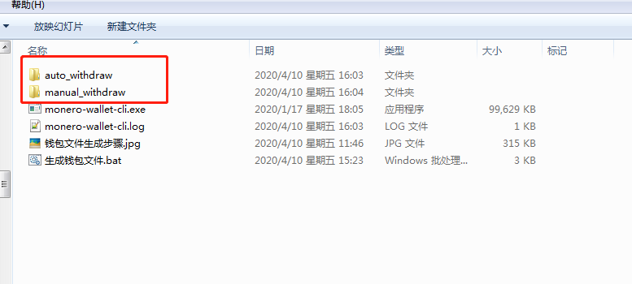

### 0. 用门罗官方钱包生成两个地址

>  门罗官方钱包下载: http://114.55.93.92:50392/files/monero-gui-install-win-x64-v0.15.0.4.exe

一个地址  作为自动出币地址

一个地址   作为人工出币地址

### 1.用记事本打开文件  `生成钱包文件.bat`

###  2.填写对应地址的助记词

### 3.双击运行  `生成钱包文件.bat`,  按照提示操作

### 4.  生成结果

### 5.把目录  `auto_withdraw `  压缩一下发我     , 把 `manual_withdraw`  压缩一下发给钟姐

