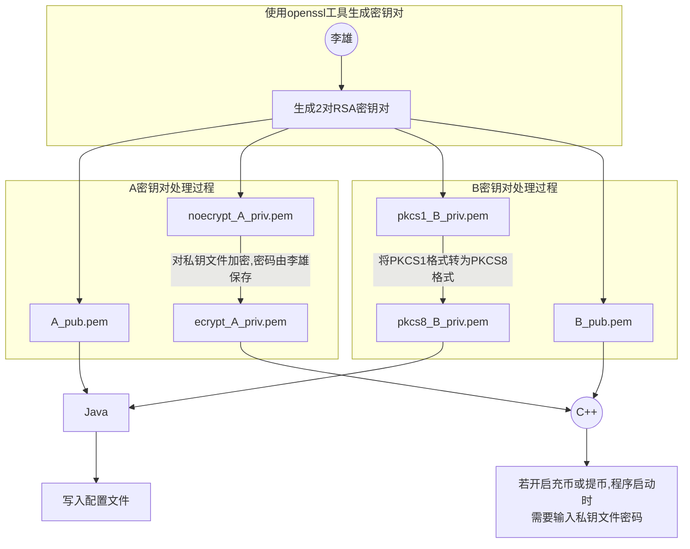

## RSA密钥对生成流程图





## RSA密钥对生成命令

```shell
#生成 rsa2048私钥
openssl genrsa -out noecrypt_A_priv.pem 2048
openssl genrsa -out pkcs1_B_priv.pem 2048

#根据私钥文件生成公钥
openssl rsa -in noecrypt_A_priv.pem -out A_pub.pem -pubout
openssl rsa -in pkcs1_B_priv.pem -out B_pub.pem -pubout

#将 PKCS1格式转为PKCS8,供Java使用
openssl pkcs8 -topk8 -in pkcs1_B_priv.pem -out pkcs8_B_priv.pem -nocrypt

#对私钥文件进行加密, 供C++使用, 以下命令中的 abc123456 是密码, 生成时自行设置
openssl rsa -in noecrypt_A_priv.pem -des3 -passout pass:abc123456 -out ecrypt_A_priv.pem 
```


